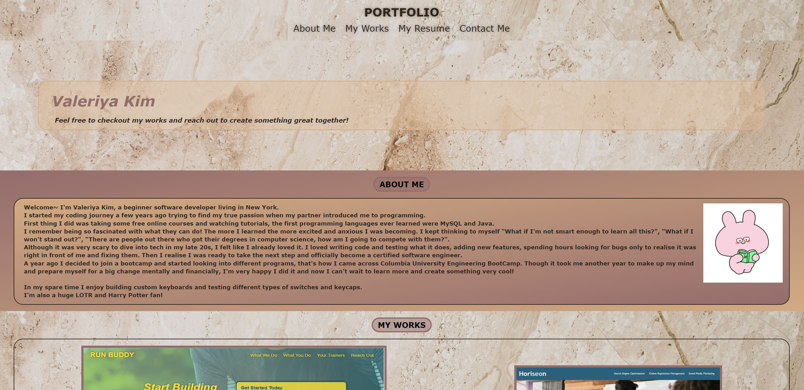
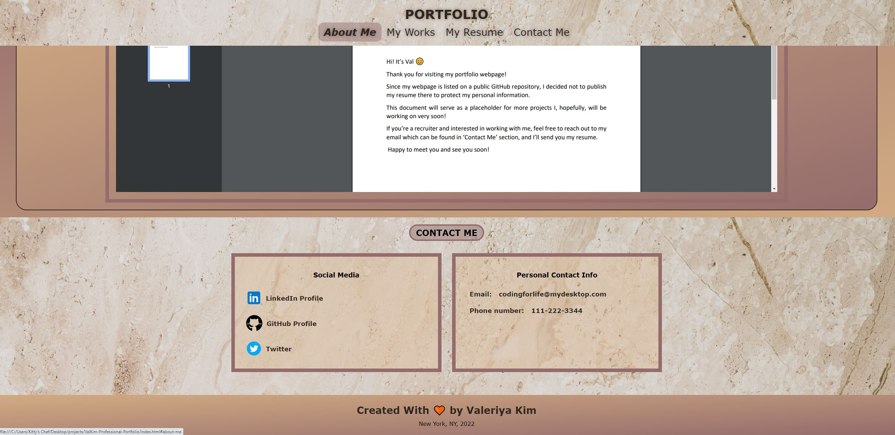

# Module2 - Challenge2 - Portfolio
### Description
Hello! This is a codebase of my portfolio webpage. 
A brief introduction with my few work examples and contact information.

Th webpage is built using HTML and CSS.
I wasn't sure if I had to follow the mock-up to the bone but I did come up with my own design structure.
The webpage is responsive to different viewports, so if you're viewing it from a tablet or smartphone there should be no inconvenience for the user.
Media Queries can be found in a separate stylesheet --> media-queries.css

### Reference
This time no starter code was provided and I built the whole webpage from scratch but not without help from amazing coding community!
See below a few resources that always help me find answers to my many questions:
- W3schools: [https://www.w3schools.com/]
- stackoverflow: [https://stackoverflow.com/]
- MDN Web Docs: [https://developer.mozilla.org/en-US/]

#### Here's a link to my webpage:

https://valkim55.github.io/ValKim-Professional-Portfolio/

#### This is what a webpage should look like

